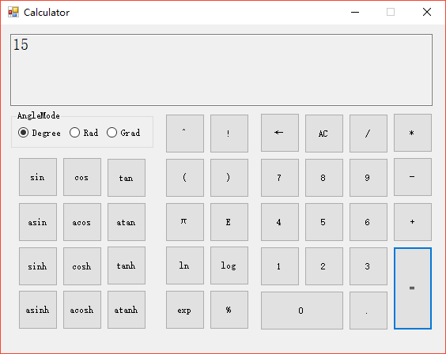

# 计算器工程说明

PB15111656 陈翊辉

PB15111612 李强

PB15111676 蔡子凯

## 平台及语言

操作系统：Windows

编写语言：

​	程序界面：VB .NET

​	计算核心：Python3

## 工程文件组织说明

\dist：二进制可执行文件

\eval：计算核心代码

\Calculator：计算器程序界面工程

其中关键代码文件为

\eval\eval.py

\Calculator\Calculator\form1.vb

# 使用说明

点击\dist\Calculator.exe运行

点击各按钮输入数字、函数、运算符等

点击=按钮计算结果

